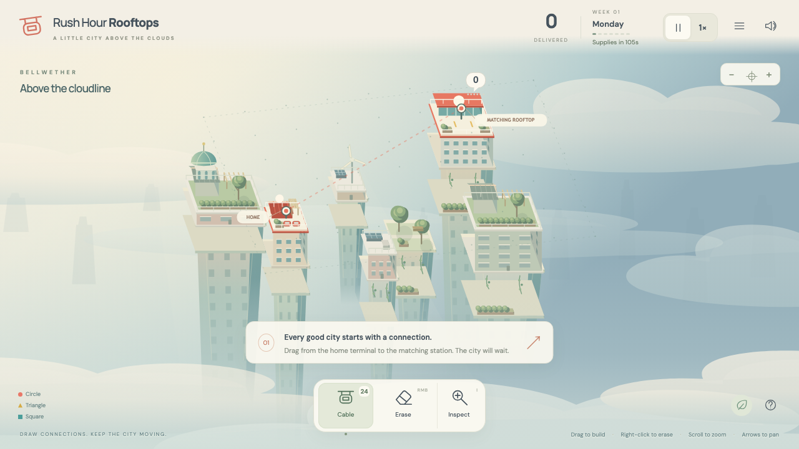
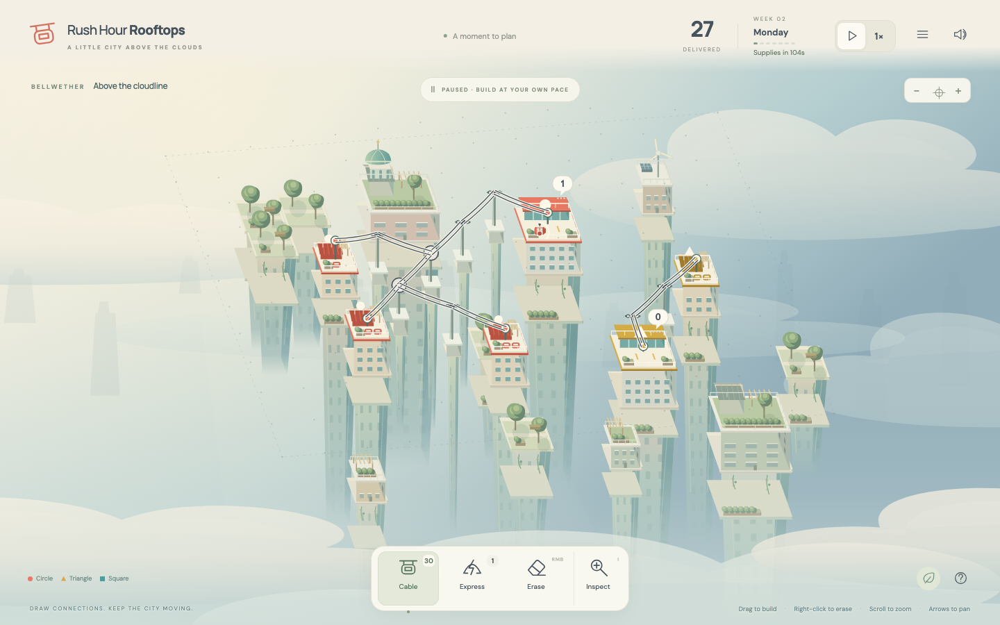

# Rush Hour Rooftops

A playable city of garden towers above the clouds. Connect matching homes and stations, keep cabins moving, and reshape your network as the skyline grows.

## Run

Requires Node.js 22.12+.

```sh
npm install
npm run dev
```

Open the local URL printed by Vite. For the production build:

```sh
npm run build
npm run preview
```

The preview normally runs at `http://127.0.0.1:4173`. You can also serve the generated `dist/` folder with any static HTTP server:

```sh
python3 -m http.server 8000 --bind 127.0.0.1 --directory dist
```

Open `http://127.0.0.1:8000`. Use HTTP rather than opening `index.html` directly. All artwork, fonts and synthesized audio are included; production makes no external requests.

## Play

- **Cable:** drag between bright terminals and grid points. Horizontal, vertical and diagonal segments work. Deliberate corners remain; small hand movements are smoothed. Garden islands block cables. Roofs are endpoints. Intersecting cables connect only at a shared point.
- **Express:** click two endpoints for a faster direct link. It crosses freely and skips intermediate junctions.
- **Interchange:** click a junction with three or more approaches to more than double its switching capacity. Eligible junctions highlight when the tool is selected.
- **Inspect:** click a roof or junction to highlight routes and matching roofs. See requests, available cabins and congestion. Clicking a roof with Cable selected also inspects it.
- **Erase / right-click:** sweep over visible cables. Occupied routes fade until committed outward and return trips finish, then supplies return. Pending refunds appear above the tray. Redrawing a fading route cancels retirement.
- **Space:** pause and build. **1 / 2:** speed. **C / E / I:** Cable, Erase, Inspect. **Escape:** cancel the current gesture, close inspection, or open the city menu. Focused buttons retain normal keyboard behavior.
- **Scroll / + / −:** zoom. **Alt-drag / middle-drag / arrows:** pan. **F:** fit the city. Offscreen alerts focus roofs needing attention.
- **City menu:** resume, help, restart this seed, or start a new city. After failure, inspect the final network before restarting.

The opening has 24 cable pieces and a close 9×7 construction area. Time waits for a valid first connection; guidance stays until the first delivery. The city reveals more space at 45 seconds and each following week. New stations wait up to 60 seconds for a connection before opening, or open early eight seconds after connection. The original station starts immediately after its first route.

Each home has two cabins. Every delivery requires a return trip. Rush hours increase requests for 14 seconds each minute. Six waiting requests start a 30-second overload clock; clearing below six drains it twice as quickly. Large stations tolerate ten. Inspect a struggling station to decide between another home, a shorter journey, an Interchange, or separate routes.

Every 105 seconds, choose 18 cables plus an Express or an eligible Interchange, or a 32-cable bundle when no junction needs an upgrade. Earned tools stay visible after their tokens are used. Sky spans and signals are no longer part of normal play; the old invisible crossing tax is removed. Their internal compatibility code remains covered by simulation tests.

The original 76 BPM score combines soft keys, warm pads and occasional wind chimes. Cloud air, distant birds and cable hum add ambience. Rush hours gently enrich the arrangement; pausing leaves a softer musical bed. Delivery chimes follow the harmony and are rate-limited. The city menu provides separate Music, Ambience and Effects sliders plus a master sound toggle. Audio begins after your first interaction and stops while the tab is hidden. Music keeps its natural tempo at either game speed.

Sound, mixer levels, reduced motion and best score are stored locally. Refreshing starts a new run; session restoration is not implemented.

## Validation

```sh
npm test
npm run test:soak
npx playwright install chromium  # once, for browser tests
npm run dev -- --port 5175 --strictPort
# In a second terminal:
npm run test:browser
```

`RHR_TEST_URL` overrides the test server URL. `RHR_CHROMIUM` optionally points to an installed Chromium executable. Browser tests use real pointer and keyboard handlers; the development-only snapshot is read-only and is absent from production.

The suite covers 43 deterministic simulation/input cases and 11 browser regressions, including four-direction diagonal gestures, safe retirement, modal focus, station recovery and progressive growth. `tests/audio-browser.mjs` additionally verifies mixing and audio lifecycle; `tests/production.mjs` smoke-tests a preview server on port 4173.




## Deploy on Vercel

Import this repository into Vercel. The checked-in `vercel.json` selects Vite, runs `npm ci` and `npm run build`, and serves `dist/`. No environment variables or backend services are required. The game synthesizes its soundtrack locally and includes its fonts.

## Code map

The 60 Hz deterministic simulation is independent of Canvas and the DOM. Double speed executes the same ticks. Pausing, hiding the tab and entering dialogs discard wall-clock backlog.

| Module | Responsibility |
| --- | --- |
| `model.ts`, `world.ts` | Entities, tuning, seeded development, reveal stages |
| `construction-search.ts`, `graph.ts` | Bounded resource-aware search, atomic gestures, upgrades, safe retirement |
| `routing.ts`, `traffic.ts` | Stable routes, reservations, FIFO service, directional lanes, junctions |
| `simulation.ts` | Progression, opening grace, rush hours, overload, clock, invariants |
| `input.ts`, `picking.ts`, `controls.ts` | Continuous gestures, screen-space erasing, pointer and keyboard ownership |
| `insight.ts`, `awareness.ts` | Network diagnoses, selection cards, persistent offscreen alerts |
| `panels.ts`, `dialog.ts`, `main.ts` | UI copy, accessible dialog focus, application integration and persistence |
| `render.ts`, `elevation.ts` | Shared elevated projection/picking, cable curves, cabins, selection highlights |
| `art.ts`, `atmosphere.ts` | Procedural tower models, wide terraces, gardens, clouds and distant skyline |
| `audio.ts`, `fixtures.ts` | Original audio cues and reproducible development scenes |

Logical travel and construction use the flat grid. A smooth seeded visual elevation field lifts roofs, cables and cabins together; picking inverts the same field. Height changes appearance without changing simulation distance. Decorative buildings make way for construction; garden islands remain protected. The generator validates a feasible approach before adding a roof and retries on a later scheduled attempt if space or resources are insufficient.

Development only: **D** opens performance and invariant diagnostics. Available fixtures: `busy`, `overload`, `retirement`, `junction`, `weekly`, `failure`, `performance`, `preview`, `blocked-preview`. Use `/?fixture=busy`, optionally `&density=1` or `&density=2`. `/?seed=12345` starts a repeatable normal city.

The design reference is Dinosaur Polo Club’s official [Mini Motorways press kit](https://dinopoloclub.com/press/mini-motorways/): growing networks, adapting limited upgrades and redesigning to preserve flow. All game art, maps, UI and audio here are original. DM Sans and Manrope use the SIL Open Font License; notices ship in `licenses/`.
