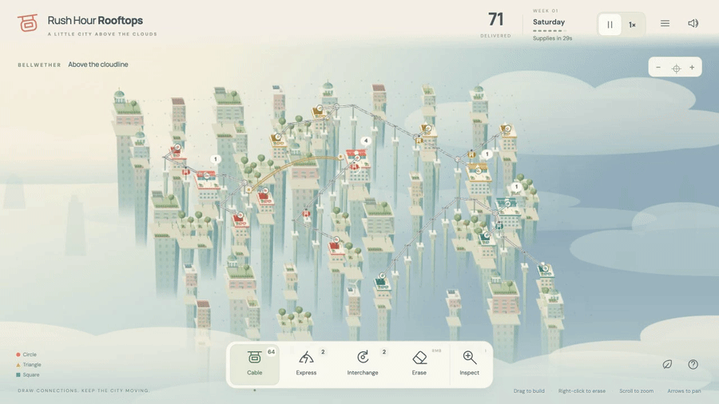
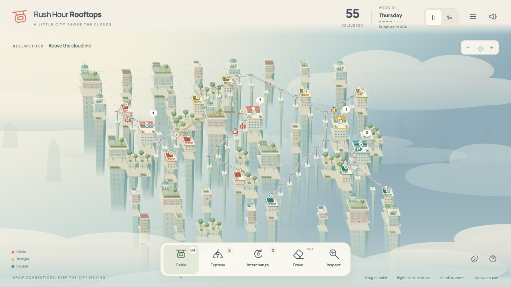

# Rush Hour Rooftops



String cable cars between rooftops and keep a city above the clouds moving through rush hour.

**[▶ Play in browser](https://kpetrovski.me/play/rush-hour-rooftops/)**




## How to play

- **Drag** between matching homes and stations to build cables. Cabins need a return route too.
- **Right-click** or **E** to erase; **I** to inspect congestion.
- **Space** pauses for planning. **1 / 2** changes speed; **scroll** zooms; **arrows** pan; **F** fits the city.
- Spend supplies on cables, Express links, and Interchanges as the skyline grows.

Turn on sound: the original synthesized score, cable hum, and delivery chimes react to the city. Audio starts after interaction. Runs restart on refresh.

## Development

TypeScript, Canvas 2D, Vite; original procedural audio.

```sh
npm install
npm run dev
```

[Development, verification, and deployment notes](DEVELOPMENT.md).
